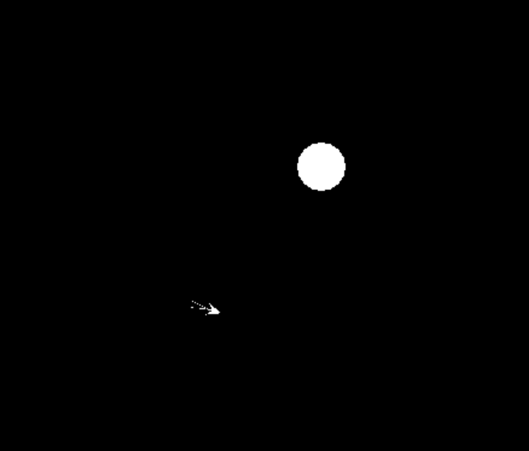

# Projects

This is a selection of projects I've worked on in my spare time.

## Dodge the Planets

### Javascript browser game

When I was first learning to program, I made a client-side javascript game: [Dodge the Planets](https://github.com/necoleman/dodge_the_planets). I got the concept working, refactored it to be object-oriented, then began work on a reinforcement learning example. The reinforcement learning module is unfinished.

You can play a version of it [here](dodge_the_planets/index.html). This version does not have the neural net.

### Desktop application

I have been reimplementing Dodge the Planets into python using [pyglet](https://pyglet.readthedocs.io/en/latest/), a cross-platform gui library. You can find my code so far [here](https://github.com/necoleman/dodge). The next steps are to move the game from naively assuming the entire window to being contained within a GUI that includes options.

## fepy

This is a small finite element library I created to solve eigenvalue problems on planar domains. I used it for some numerical studies in my graduate dissertation.

The code can be found [here](https://github.com/necoleman/fepy).
